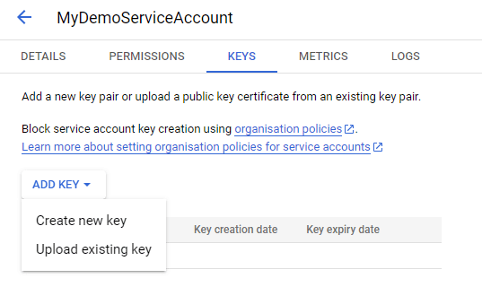

# Setup The Plugin

This section covers how to setup the plugin. It assumes you already have a standard Google Account.

## **1.** Enable Google Cloud Storage
1. Go to [Google Cloud Storage website](https://cloud.google.com/storage) and click on `Try Storage free`.
2. If you don't have a Google Cloud account, fill in the asked information.
3. If you don't have a Google Cloud project, create one.

## **2.** Create a Service Account.
1. Open [Service Accounts](https://console.cloud.google.com/iam-admin/serviceaccounts) in the Google Cloud console.
2. Click on `CREATE SERVICE ACCOUNT`.
3. Fill in the service account details.

<div class="centered">


</div>

4. Open [the role creation tool](https://console.cloud.google.com/iam-admin/roles/create).
5. Add permissions for Cloud Storage. Make sure to assign as little permission as needed for what you want to do.

<div class="centered">


</div>


6. Open [IAM](https://console.cloud.google.com/iam-admin/iam) in the Google Cloud console.
7. Click on `GRANT ACCESS`.
8. In the `Add Principals` category, select the service account created in the previous section.
9. Assign the role created previously to the account.

<div class="centered">


</div>


## **3.** Download Credentials

1. Open the [Service Accounts page](https://console.cloud.google.com/iam-admin/serviceaccounts).
2. Click on your service account name.
3. Under keys, click `ADD KEY` and select `Create new key`.

<div class="centered">



</div>

4. Select `JSON` as key type and click `CREATE`.
5. It will download a file named `<ProjectName>-<KeyId>.json`.

## **4.** (Optional) Setup Plugin for C++
An additional setup must be done to use the plugin from C++. You can skip this step if you don't intend to use the plugin using C++.

### **4.1.** Add the `GoogleTTS` Module
Open the `<ModuleName>.Build.cs` file and add the following lines in the constructor:

```cs
PrivateDependencyModuleNames.Add("GoogleCloud");
PrivateDependencyModuleNames.Add("GoogleCloudStorage");
```

> You need to regenerate project files for the includes to work.

### **4.2.** Include the Files

At the top of the file where you want to use the API, add the following lines:

```cpp
#include "GoogleCloud/GoogleCloud.h"
#include "GoogleCloudStorage/GoogleCloudStorage.h"
```


<script>
setTimeout(() => {
	bShowCPP = !JSON.parse(getCookie('bShowCPP'));
	switchCode();
}, 0);
</script>

